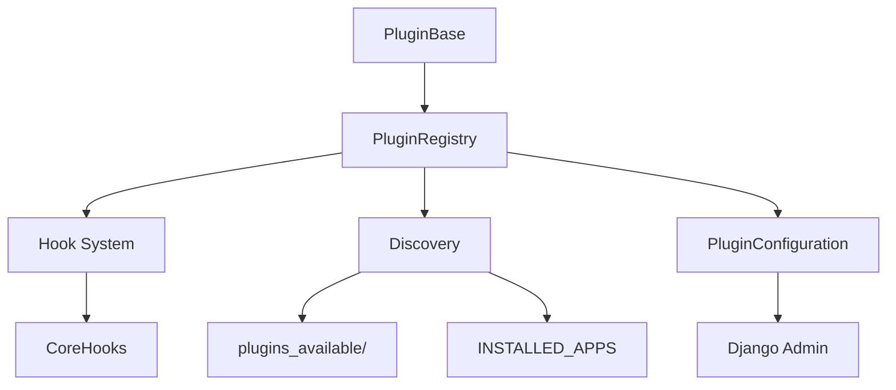

# Ta3lem LMS - Plugin Development Guide

Panduan lengkap untuk mengembangkan plugin pada Ta3lem LMS.

---

## Table of Contents

1. [Arsitektur Plugin](#arsitektur-plugin)
2. [Membuat Plugin Baru](#membuat-plugin-baru)
3. [Hook System](#hook-system)
4. [Integrasi Views](#integrasi-views)
5. [Integrasi Models](#integrasi-models)
6. [Integrasi Templates](#integrasi-templates)
7. [Konfigurasi & Admin](#konfigurasi--admin)
8. [Best Practices](#best-practices)
9. [Contoh Plugin Lengkap](#contoh-plugin-lengkap)

---

## Arsitektur Plugin



### Komponen Utama

| Komponen | File | Fungsi |
|----------|------|--------|
| `PluginBase` | `plugins/base.py` | Abstract base class untuk semua plugin |
| `PluginRegistry` | `plugins/registry.py` | Singleton untuk registrasi & manajemen plugin |
| `CoreHooks` | `plugins/hooks.py` | Enum hook points yang tersedia |
| `PluginConfiguration` | `plugins/models.py` | Model database untuk konfigurasi |
| `discover_plugins()` | `plugins/discovery.py` | Auto-discovery plugin |

---

## Membuat Plugin Baru

### Langkah 1: Buat Struktur Direktori

```bash
# Di dalam plugins_available/
mkdir -p plugins_available/my_plugin
touch plugins_available/my_plugin/__init__.py
touch plugins_available/my_plugin/plugin.py
```

### Langkah 2: Buat Plugin Class

```python
# plugins_available/my_plugin/plugin.py

from plugins.base import PluginBase
from plugins.hooks import CoreHooks, hook


class MyPlugin(PluginBase):
    """Deskripsi plugin Anda"""
    
    # === REQUIRED: Metadata ===
    name = "my_plugin"  # Unique identifier
    version = "1.0.0"
    description = "Deskripsi singkat plugin"
    author = "Nama Anda"
    
    # === OPTIONAL: Configuration ===
    enabled_by_default = False  # Default: disabled
    requires = []  # Dependencies: ["other_plugin"]
    
    default_settings = {
        'setting_key': 'default_value',
        'another_setting': True,
    }
    
    # === LIFECYCLE METHODS ===
    
    def ready(self):
        """
        Dipanggil saat plugin di-load.
        Gunakan untuk inisialisasi.
        """
        import logging
        self.logger = logging.getLogger(__name__)
        self.logger.info(f"{self.name} initialized")
    
    def on_enable(self):
        """Dipanggil saat plugin di-enable"""
        pass
    
    def on_disable(self):
        """Dipanggil saat plugin di-disable"""
        pass
    
    # === HOOK HANDLERS ===
    # Lihat bagian Hook System
```

### Langkah 3: Restart Server

Plugin akan otomatis di-discover saat Django start:

```bash
python manage.py runserver
# Output: INFO Registered plugin: my_plugin v1.0.0
```

---

## Hook System

### Daftar Hook yang Tersedia

```python
from plugins.hooks import CoreHooks

# === User Lifecycle ===
CoreHooks.USER_REGISTERED      # user=User
CoreHooks.USER_LOGIN           # user=User, request=HttpRequest
CoreHooks.USER_LOGOUT          # user=User

# === Course Lifecycle ===
CoreHooks.COURSE_CREATED       # course=Course
CoreHooks.COURSE_PUBLISHED     # course=Course
CoreHooks.COURSE_COMPLETED     # user=User, course=Course, enrollment=Enrollment

# === Enrollment ===
CoreHooks.COURSE_ENROLLED      # user=User, course=Course, enrollment=Enrollment
CoreHooks.COURSE_UNENROLLED    # user=User, course=Course

# === Payment ===
CoreHooks.PAYMENT_COMPLETED    # user=User, order=Order
CoreHooks.PAYMENT_FAILED       # user=User, order=Order

# === Subscription ===
CoreHooks.SUBSCRIPTION_CREATED   # user=User, subscription=Subscription
CoreHooks.SUBSCRIPTION_CANCELLED # user=User, subscription=Subscription

# === Template Injection ===
CoreHooks.TEMPLATE_HEAD        # request=HttpRequest
CoreHooks.TEMPLATE_BODY_START  # request=HttpRequest
CoreHooks.TEMPLATE_BODY_END    # request=HttpRequest
CoreHooks.TEMPLATE_COURSE_DETAIL  # request, course, context
```

### Menggunakan Hook Decorator

```python
from plugins.hooks import CoreHooks, hook

class MyPlugin(PluginBase):
    name = "my_plugin"
    
    @hook(CoreHooks.COURSE_COMPLETED, priority=10)
    def on_course_completed(self, user=None, course=None, enrollment=None, **kwargs):
        """
        Priority: semakin kecil, semakin awal dieksekusi
        Default priority = 10
        """
        # Lakukan sesuatu
        self.logger.info(f"{user} completed {course}")
        
        # Return value dikumpulkan di trigger_hook()
        return {'status': 'processed'}
    
    @hook(CoreHooks.TEMPLATE_BODY_END)
    def inject_script(self, request=None, **kwargs):
        """Inject HTML ke dalam template"""
        return '<script>console.log("Hello from plugin")</script>'
```

### Trigger Hook Secara Manual

```python
from plugins.hooks import trigger_hook, CoreHooks

# Di view atau service:
results = trigger_hook(
    CoreHooks.COURSE_COMPLETED,
    user=request.user,
    course=course,
    enrollment=enrollment
)
# results = list of return values from all handlers
```

---

## Integrasi Views

### 1. Plugin dengan Views Sendiri

Plugin dapat memiliki views dan URL patterns sendiri:

```python
# plugins_available/badges/plugin.py

class BadgesPlugin(PluginBase):
    name = "badges"
    version = "1.0.0"
    
    def get_urls(self):
        """
        Define plugin URL patterns.
        URLs akan di-mount di /plugins/badges/
        """
        from django.urls import path
        from . import views
        
        return [
            path('', views.badge_list, name='badges_list'),
            path('<int:pk>/', views.badge_detail, name='badge_detail'),
            path('my-badges/', views.my_badges, name='my_badges'),
            path('leaderboard/', views.leaderboard, name='leaderboard'),
        ]
```

```python
# plugins_available/badges/views.py

from django.shortcuts import render, get_object_or_404
from django.contrib.auth.decorators import login_required
from .models import Badge, UserBadge

def badge_list(request):
    """List semua badges yang tersedia"""
    badges = Badge.objects.filter(is_active=True)
    return render(request, 'badges/list.html', {
        'badges': badges,
    })

def badge_detail(request, pk):
    """Detail badge tertentu"""
    badge = get_object_or_404(Badge, pk=pk)
    return render(request, 'badges/detail.html', {
        'badge': badge,
    })

@login_required
def my_badges(request):
    """Badges yang sudah didapat user"""
    user_badges = UserBadge.objects.filter(user=request.user)
    return render(request, 'badges/my_badges.html', {
        'user_badges': user_badges,
    })

def leaderboard(request):
    """Leaderboard badges"""
    from django.db.models import Count
    top_users = UserBadge.objects.values('user__username').annotate(
        badge_count=Count('id')
    ).order_by('-badge_count')[:10]
    
    return render(request, 'badges/leaderboard.html', {
        'top_users': top_users,
    })
```

**Akses URLs:**
- `/plugins/badges/` - List badges
- `/plugins/badges/42/` - Detail badge
- `/plugins/badges/my-badges/` - User's badges
- `/plugins/badges/leaderboard/` - Leaderboard

---

### 2. Menggunakan Hook di View Existing

Trigger plugin hooks dari views existing:

```python
# courses/views.py

from django.views.generic import DetailView
from plugins.hooks import trigger_hook, CoreHooks
from .models import Course

class CourseDetailView(DetailView):
    model = Course
    template_name = 'courses/detail.html'
    
    def get_context_data(self, **kwargs):
        context = super().get_context_data(**kwargs)
        
        # Trigger hook - plugin dapat inject data
        plugin_data = trigger_hook(
            CoreHooks.TEMPLATE_COURSE_DETAIL,
            request=self.request,
            course=self.object,
            context=context
        )
        context['plugin_content'] = ''.join(str(d) for d in plugin_data if d)
        
        return context
    
    def get(self, request, *args, **kwargs):
        response = super().get(request, *args, **kwargs)
        
        # Trigger view hook setelah render
        trigger_hook(
            CoreHooks.COURSE_VIEWED,
            user=request.user if request.user.is_authenticated else None,
            course=self.object,
            request=request
        )
        
        return response
```

---

### 3. Extend Views Existing (via Mixin Injection)

Inject mixin ke view class existing saat plugin ready:

```python
# plugins_available/analytics/mixins.py

class AnalyticsViewMixin:
    """Mixin untuk menambah analytics behavior ke views"""
    
    def get_context_data(self, **kwargs):
        context = super().get_context_data(**kwargs)
        
        # Inject analytics data
        context['page_views'] = self.get_page_views()
        context['analytics_enabled'] = True
        
        return context
    
    def get_page_views(self):
        """Get view count for current object"""
        from plugins_available.analytics.models import PageView
        
        if hasattr(self, 'object') and self.object:
            return PageView.objects.filter(
                content_type__model=self.object._meta.model_name,
                object_id=self.object.pk
            ).count()
        return 0
    
    def dispatch(self, request, *args, **kwargs):
        # Track page view
        response = super().dispatch(request, *args, **kwargs)
        self.track_page_view(request)
        return response
    
    def track_page_view(self, request):
        """Record page view"""
        from plugins_available.analytics.models import PageView
        
        if hasattr(self, 'object') and self.object:
            PageView.objects.create(
                content_type=ContentType.objects.get_for_model(self.object),
                object_id=self.object.pk,
                user=request.user if request.user.is_authenticated else None,
                ip_address=request.META.get('REMOTE_ADDR'),
            )
```

```python
# plugins_available/analytics/plugin.py

class AnalyticsPlugin(PluginBase):
    name = "analytics"
    
    def ready(self):
        self.inject_mixins()
    
    def inject_mixins(self):
        """Inject analytics mixin ke views yang ditargetkan"""
        from courses.views import CourseDetailView, CourseListView
        from .mixins import AnalyticsViewMixin
        
        # Inject mixin ke view classes
        target_views = [CourseDetailView, CourseListView]
        
        for view_class in target_views:
            if AnalyticsViewMixin not in view_class.__bases__:
                # Prepend mixin to bases
                view_class.__bases__ = (AnalyticsViewMixin,) + view_class.__bases__
        
        self.logger.info("Analytics mixin injected to views")
```

---

### 4. Override Views via URL Priority

Override view dengan menambahkan URL pattern yang lebih spesifik:

```python
# plugins_available/custom_course/urls.py

from django.urls import path
from . import views

# Custom course detail view
app_name = 'custom_course'

urlpatterns = [
    # Override /courses/<slug>/ dengan custom view
    path('courses/<slug:slug>/', 
         views.CustomCourseDetailView.as_view(), 
         name='course_detail'),
]
```

```python
# plugins_available/custom_course/views.py

from courses.views import CourseDetailView

class CustomCourseDetailView(CourseDetailView):
    """Extended course detail dengan fitur tambahan"""
    template_name = 'custom_course/detail.html'
    
    def get_context_data(self, **kwargs):
        context = super().get_context_data(**kwargs)
        
        # Tambah data custom
        context['related_courses'] = self.get_related_courses()
        context['instructor_bio'] = self.object.owner.bio
        
        return context
    
    def get_related_courses(self):
        from courses.models import Course
        return Course.objects.filter(
            subject=self.object.subject
        ).exclude(pk=self.object.pk)[:4]
```

```python
# ta3lem/urls.py - Include plugin URLs BEFORE main urls

urlpatterns = [
    # Plugin URLs first (higher priority)
    path('', include('plugins_available.custom_course.urls')),
    
    # Main app URLs
    path('', include('courses.urls')),
]
```

---

### 5. Cek Plugin Status di Views

```python
from plugins.registry import plugin_registry

def my_view(request):
    pricing_plugin = plugin_registry.get('pricing')
    
    if pricing_plugin and pricing_plugin.is_enabled:
        # Show pricing UI
        pass
    
    # Atau gunakan helper function dari plugin:
    from plugins_available.pricing.plugin import is_pricing_enabled
    
    if is_pricing_enabled():
        # Show pricing UI
        pass
```

---

### 6. Decorator untuk Feature Flag

Gunakan decorator untuk protect views:

```python
from plugins import requires_plugin

@requires_plugin('pricing')
def purchase_course(request, course_id):
    """View ini hanya tersedia jika pricing plugin enabled"""
    pass

@requires_plugin('badges')
def award_badge(request, user_id, badge_id):
    """View ini hanya tersedia jika badges plugin enabled"""
    pass
```

Class-based view:

```python
from django.utils.decorators import method_decorator
from plugins import requires_plugin

@method_decorator(requires_plugin('analytics'), name='dispatch')
class AnalyticsDashboardView(TemplateView):
    template_name = 'analytics/dashboard.html'
```

---

### Perbandingan Pendekatan Views

| Pendekatan | Use Case | Kapan Digunakan |
|------------|----------|-----------------|
| **Plugin URLs** | Views baru | Fitur standalone (badges, analytics) |
| **Hook Integration** | Inject data | Tambah context ke views existing |
| **Mixin Injection** | Extend behavior | Tambah methods/logic ke views |
| **URL Override** | Replace views | Ganti total implementasi view |

---


## Integrasi Models

### Plugin dengan Model Sendiri

```python
# plugins_available/badges/models.py

from django.db import models
from django.conf import settings

class Badge(models.Model):
    """Badge yang bisa didapat user"""
    name = models.CharField(max_length=100)
    description = models.TextField()
    icon = models.ImageField(upload_to='badges/')
    points_required = models.PositiveIntegerField(default=0)
    
    class Meta:
        app_label = 'badges'  # PENTING untuk plugin dengan model

class UserBadge(models.Model):
    """Badge yang sudah didapat user"""
    user = models.ForeignKey(
        settings.AUTH_USER_MODEL,
        on_delete=models.CASCADE,
        related_name='badges'
    )
    badge = models.ForeignKey(Badge, on_delete=models.CASCADE)
    earned_at = models.DateTimeField(auto_now_add=True)
    
    class Meta:
        app_label = 'badges'
        unique_together = ['user', 'badge']
```

### Daftarkan sebagai Django App

```python
# plugins_available/badges/apps.py

from django.apps import AppConfig

class BadgesConfig(AppConfig):
    default_auto_field = 'django.db.models.BigAutoField'
    name = 'plugins_available.badges'
    label = 'badges'
```

```python
# ta3lem/settings/base.py

INSTALLED_APPS = [
    # ...existing apps...
    'plugins_available.badges',  # Tambahkan
]
```

### Migrasi

```bash
python manage.py makemigrations badges
python manage.py migrate badges
```

---

### Extend Model yang Sudah Ada

Plugin dapat menambahkan functionality ke model existing dengan beberapa cara:

#### 1. Mixin Pattern (Recommended)

Tambahkan methods ke model existing via mixin yang di-inject saat plugin ready:

```python
# plugins_available/analytics/mixins.py

class CourseAnalyticsMixin:
    """Mixin untuk menambah analytics methods ke Course"""
    
    def get_view_count(self):
        from plugins_available.analytics.models import CourseView
        return CourseView.objects.filter(course_id=self.id).count()
    
    def get_completion_rate(self):
        total = self.course_enrollments.count()
        completed = self.course_enrollments.filter(status='completed').count()
        return (completed / total * 100) if total > 0 else 0
```

```python
# plugins_available/analytics/plugin.py

class AnalyticsPlugin(PluginBase):
    name = "analytics"
    
    def ready(self):
        # Inject mixin ke Course model
        from courses.models import Course
        from .mixins import CourseAnalyticsMixin
        
        for name, method in CourseAnalyticsMixin.__dict__.items():
            if not name.startswith('_') and callable(method):
                setattr(Course, name, method)
        
        self.logger.info("Analytics methods injected to Course model")
```

**Penggunaan:**
```python
course = Course.objects.get(pk=1)
print(course.get_view_count())  # Method dari plugin!
```

---

#### 2. OneToOne Relationship (untuk data tambahan)

Buat model terpisah dengan relasi OneToOne ke model existing:

```python
# plugins_available/gamification/models.py

from django.db import models

class CourseGameStats(models.Model):
    """Extend Course dengan data gamification"""
    course = models.OneToOneField(
        'courses.Course',
        on_delete=models.CASCADE,
        related_name='game_stats'  # Akses: course.game_stats
    )
    total_points = models.IntegerField(default=0)
    leaderboard_enabled = models.BooleanField(default=True)
    
    class Meta:
        app_label = 'gamification'


class UserGameProfile(models.Model):
    """Extend User dengan game profile"""
    user = models.OneToOneField(
        'users.User',
        on_delete=models.CASCADE,
        related_name='game_profile'  # Akses: user.game_profile
    )
    experience_points = models.IntegerField(default=0)
    level = models.IntegerField(default=1)
    
    class Meta:
        app_label = 'gamification'
```

**Penggunaan:**
```python
course = Course.objects.get(pk=1)
stats = course.game_stats  # Access plugin data
stats.total_points += 100
stats.save()
```

**Auto-create on access:**
```python
# Di plugin.py
@hook(CoreHooks.COURSE_CREATED)
def create_game_stats(self, course=None, **kwargs):
    from .models import CourseGameStats
    CourseGameStats.objects.get_or_create(course=course)
```

---

#### 3. GenericForeignKey (data polymorphic)

Untuk menyimpan data arbitrary ke model apapun:

```python
# plugins_available/meta/models.py

from django.contrib.contenttypes.fields import GenericForeignKey
from django.contrib.contenttypes.models import ContentType

class PluginMetadata(models.Model):
    """Attach arbitrary metadata ke model apapun"""
    content_type = models.ForeignKey(ContentType, on_delete=models.CASCADE)
    object_id = models.PositiveIntegerField()
    target = GenericForeignKey('content_type', 'object_id')
    
    plugin_name = models.CharField(max_length=100)
    key = models.CharField(max_length=100)
    value = models.JSONField()
    
    class Meta:
        app_label = 'plugin_meta'
        unique_together = ['content_type', 'object_id', 'plugin_name', 'key']
```

**Penggunaan:**
```python
from django.contrib.contenttypes.models import ContentType
from plugins_available.meta.models import PluginMetadata

# Simpan metadata untuk Course
ct = ContentType.objects.get_for_model(course)
PluginMetadata.objects.update_or_create(
    content_type=ct,
    object_id=course.id,
    plugin_name='analytics',
    key='last_viewed',
    defaults={'value': {'date': '2024-01-01'}}
)
```

---

#### 4. Monkey Patching (Advanced - Hati-hati!)

Tambah method/property langsung ke model class:

```python
# plugins_available/seo/plugin.py

class SEOPlugin(PluginBase):
    name = "seo"
    
    def ready(self):
        from courses.models import Course
        
        # Tambah property
        @property
        def seo_title(self):
            return f"{self.title} | Learn Online"
        
        # Tambah method
        def get_meta_description(self):
            return self.overview[:160] if self.overview else ""
        
        # Inject ke model
        Course.seo_title = seo_title
        Course.get_meta_description = get_meta_description
```

> ⚠️ **Warning**: Monkey patching memiliki risiko:
> - Bisa konflik dengan plugin lain
> - Sulit debug
> - Bisa break saat Django upgrade
> 
> **Gunakan Mixin Pattern atau OneToOne sebagai alternatif yang lebih aman.**

---

#### Perbandingan Pendekatan

| Pendekatan | Use Case | Pros | Cons |
|------------|----------|------|------|
| **Mixin** | Tambah methods | Clean, testable | Tidak persistendata |
| **OneToOne** | Tambah fields/data | Data persisten, aman | Extra join query |
| **GenericFK** | Data polymorphic | Sangat fleksibel | Complex queries |
| **Monkey Patch** | Quick hacks | Cepat | Risiko konflik |


## Integrasi Templates

### 1. Setup Base Template

Tambahkan hook points ke base template untuk plugin injection:

```html
<!-- templates/base.html -->

<!DOCTYPE html>
<html lang="id">
<head>
    <meta charset="UTF-8">
    <meta name="viewport" content="width=device-width, initial-scale=1.0">
    <title>Ta3lem LMS</title>
    
    <!-- Standard CSS -->
    <link rel="stylesheet" href="">
    
    <!-- Plugin CSS Injection -->
    {{ template_hooks.head|safe }}
</head>
<body>
    <!-- Plugin dapat inject banner, modals, dll di awal body -->
    {{ template_hooks.body_start|safe }}
    
    <!-- Navigation -->
    <nav class="navbar">
        
    </nav>
    
    <!-- Main Content -->
    <main>
        
    </main>
    
    <!-- Footer -->
    <footer>
        {{ template_hooks.footer|safe }}
    </footer>
    
    <!-- Standard JS -->
    <script src=""></script>
    
    <!-- Plugin Scripts Injection -->
    {{ template_hooks.body_end|safe }}
</body>
</html>
```

---

### 2. Template Tags Reference

Load template tags di template:

```html

```

#### Tag: ``

Trigger hook dan output HTML yang di-return oleh handlers:

```html
<!-- Sidebar dengan plugin widget -->
<aside class="sidebar">
    <h3>Tools</h3>
    
</aside>

<!-- Course detail page -->
<div class="course-detail">
    <h1>{{ course.title }}</h1>
    
    <!-- Plugin pricing/subscription CTA -->
    
    
    <div class="course-content">
        {{ course.overview }}
    </div>
    
    <!-- Plugin related content (reviews, Q&A, etc) -->
    
</div>
```

#### Tag: ``

Conditional rendering berdasarkan plugin status:

```html




<div class="achievement-badge">
    🏆 {{ user.game_profile.level }} Level
</div>



<button class="btn btn-primary">
    Beli Kursus - {{ course.get_formatted_price }}
</button>

<p class="text-muted">Pembelian tidak tersedia</p>

```

#### Tag: ``

Ambil setting dari plugin:

```html



<p>Mata uang: {{ currency }}</p>


<div class="leaderboard">
    
</div>

```

#### Tag: ``

Panggil method plugin secara langsung:

```html
<!-- Call plugin.render_widget() -->


<!-- Call plugin.get_stats() dan tampilkan -->

```

---

### 3. Contoh Praktis: Course Detail Page

```html
<!-- courses/templates/courses/detail.html -->




<div class="course-detail-page">
    
    <!-- Course Header -->
    <header class="course-header">
        <h1>{{ course.title }}</h1>
        <p class="instructor">By {{ course.owner.get_full_name }}</p>
        
        <!-- Plugin: Multiple instructors (jika enabled) -->
        
        
            <div class="co-instructors">
                
                    <span class="instructor-badge">{{ instructor.get_full_name }}</span>
                
            </div>
        
    </header>
    
    <!-- Pricing Section -->
    <section class="pricing-section">
        
        
        
        
            <button class="btn btn-success">Daftar Gratis</button>
        
        
            <button class="btn btn-primary">
                Beli - {{ course.get_formatted_price }}
            </button>
        
        
        
            <p class="text-muted">Atau akses dengan langganan</p>
            <a href="" class="btn btn-outline">
                Lihat Paket Langganan
            </a>
        
    </section>
    
    <!-- Course Content -->
    <section class="course-overview">
        <h2>Tentang Kursus</h2>
        {{ course.overview }}
    </section>
    
    <!-- Modules -->
    <section class="course-modules">
        <h2>Materi Kursus</h2>
        
            <div class="module">
                <h3>{{ module.title }}</h3>
            </div>
        
    </section>
    
    <!-- Plugin Injection Area -->
    <section class="plugin-content">
        
    </section>
    
    <!-- Reviews (via plugin) -->
    
    
        <section class="course-reviews">
            <h2>Ulasan</h2>
            
        </section>
    
    
</div>

```

---

### 4. Plugin-side Template Rendering

Di plugin, buat handler yang render template:

```python
# plugins_available/reviews/plugin.py

from plugins.base import PluginBase
from plugins.hooks import CoreHooks, hook

class ReviewsPlugin(PluginBase):
    name = "reviews"
    version = "1.0.0"
    
    def ready(self):
        pass
    
    def render_course_reviews(self, request=None, course=None, **kwargs):
        """
        Dipanggil via 
        """
        if not course:
            return ""
        
        from django.template.loader import render_to_string
        from .models import Review
        
        reviews = Review.objects.filter(course=course, is_approved=True)[:10]
        
        return render_to_string('reviews/course_reviews.html', {
            'reviews': reviews,
            'course': course,
            'can_review': request.user.is_authenticated if request else False,
        })
    
    @hook(CoreHooks.TEMPLATE_COURSE_DETAIL, priority=50)
    def inject_review_summary(self, request=None, context=None, **kwargs):
        """
        Auto-inject review summary via hook
        """
        course = context.get('course') if context else None
        if not course:
            return ""
        
        from django.template.loader import render_to_string
        from .models import Review
        
        stats = Review.objects.filter(course=course).aggregate(
            avg_rating=models.Avg('rating'),
            count=models.Count('id')
        )
        
        return render_to_string('reviews/summary_badge.html', {
            'avg_rating': stats['avg_rating'] or 0,
            'review_count': stats['count'] or 0,
        })
```

Plugin template:

```html
<!-- plugins_available/reviews/templates/reviews/course_reviews.html -->

<div class="reviews-container">
    
    <div class="review-card">
        <div class="review-header">
            <span class="reviewer">{{ review.user.get_full_name }}</span>
            <span class="rating">⭐ {{ review.rating }}/5</span>
        </div>
        <p class="review-content">{{ review.content }}</p>
        <small class="review-date">{{ review.created_at|date:"d M Y" }}</small>
    </div>
    
    <p class="no-reviews">Belum ada ulasan untuk kursus ini.</p>
    
    
    
    <a href="#" class="btn btn-outline" id="write-review">
        Tulis Ulasan
    </a>
    
</div>
```

---

### 5. Template Hook Summary

| Hook Name | Location | Purpose |
|-----------|----------|---------|
| `template.head` | `<head>` | CSS, meta tags, fonts |
| `template.body_start` | After `<body>` | Banners, announcements |
| `template.body_end` | Before `</body>` | Scripts, analytics |
| `template.footer` | Footer area | Footer widgets |
| `template.sidebar` | Sidebar | Sidebar widgets |
| `template.course_detail` | Course page | Course-specific content |
| `template.user_dashboard` | Dashboard | Dashboard widgets |

---


## Konfigurasi & Admin

### Akses Plugin Settings

```python
class MyPlugin(PluginBase):
    name = "my_plugin"
    
    default_settings = {
        'max_items': 10,
        'show_footer': True,
    }
    
    def some_method(self):
        # Get current settings (merged with defaults)
        settings = self.get_settings()
        
        max_items = settings.get('max_items', 10)
        show_footer = settings.get('show_footer', True)
```

### Update Settings via Code

```python
from plugins.models import PluginConfiguration

config = PluginConfiguration.objects.get(name='my_plugin')
config.config['max_items'] = 20
config.save()
```

### Admin Interface

Plugin otomatis muncul di Django Admin:

```
Admin → Plugin Configurations
├── my_plugin (ENABLED)
├── pricing (ENABLED)  
└── subscriptions_feature (ENABLED)
```

---

## Best Practices

### 1. Gunakan Logging

```python
def ready(self):
    import logging
    self.logger = logging.getLogger(__name__)
    self.logger.info(f"{self.name} v{self.version} initialized")
```

### 2. Handle Import Errors

```python
@hook(CoreHooks.COURSE_COMPLETED)
def on_complete(self, **kwargs):
    try:
        from some_external_lib import something
        # use it
    except ImportError:
        self.logger.warning("External lib not available")
        return None
```

### 3. Gunakan Priority dengan Bijak

```python
# Priority rendah = eksekusi lebih awal
@hook(CoreHooks.PAYMENT_COMPLETED, priority=1)   # First
@hook(CoreHooks.PAYMENT_COMPLETED, priority=10)  # Default
@hook(CoreHooks.PAYMENT_COMPLETED, priority=100) # Last
```

### 4. Cek is_enabled

```python
@hook(CoreHooks.TEMPLATE_BODY_END)
def inject_content(self, **kwargs):
    if not self.is_enabled:
        return ""
    return "<script>...</script>"
```

### 5. Dokumentasikan Settings

```python
default_settings = {
    # Max items to show in widget
    'max_items': 10,
    
    # Enable footer badge display
    'show_footer': True,
    
    # Custom CSS class for styling
    'css_class': 'my-plugin-widget',
}
```

---

## Contoh Plugin Lengkap

### Badges/Achievements Plugin

```python
# plugins_available/badges/plugin.py

from plugins.base import PluginBase
from plugins.hooks import CoreHooks, hook


class BadgesPlugin(PluginBase):
    """
    Gamification plugin: Award badges for achievements
    """
    
    name = "badges"
    version = "1.0.0"
    description = "Award badges for course completions and achievements"
    author = "Ta3lem Team"
    
    enabled_by_default = True
    requires = []
    
    default_settings = {
        'enable_notifications': True,
        'show_in_profile': True,
        'points_per_completion': 100,
    }
    
    def ready(self):
        import logging
        self.logger = logging.getLogger(__name__)
        self.logger.info(f"Badges plugin v{self.version} ready")
    
    @hook(CoreHooks.COURSE_COMPLETED, priority=5)
    def award_completion_badge(self, user=None, course=None, **kwargs):
        """Award badge when user completes a course"""
        if not user or not course:
            return None
        
        settings = self.get_settings()
        points = settings.get('points_per_completion', 100)
        
        try:
            from .models import Badge, UserBadge
            
            # Find applicable badge
            badge = Badge.objects.filter(
                points_required__lte=points
            ).first()
            
            if badge:
                user_badge, created = UserBadge.objects.get_or_create(
                    user=user,
                    badge=badge
                )
                
                if created:
                    self.logger.info(f"Awarded {badge.name} to {user}")
                    return {'badge': badge.name, 'user': user.username}
        
        except ImportError:
            self.logger.warning("Badge models not available")
        
        return None
    
    @hook(CoreHooks.TEMPLATE_USER_DASHBOARD, priority=10)
    def inject_badge_widget(self, request=None, **kwargs):
        """Show user's badges on dashboard"""
        if not self.is_enabled or not request:
            return ""
        
        settings = self.get_settings()
        if not settings.get('show_in_profile', True):
            return ""
        
        from django.template.loader import render_to_string
        
        try:
            from .models import UserBadge
            badges = UserBadge.objects.filter(user=request.user)[:5]
            
            return render_to_string('badges/widget.html', {
                'badges': badges,
            })
        except:
            return ""
    
    def get_urls(self):
        """Plugin URLs mounted at /plugins/badges/"""
        from django.urls import path
        from . import views
        
        return [
            path('', views.badge_list, name='badge_list'),
            path('<int:pk>/', views.badge_detail, name='badge_detail'),
        ]
```

---

## Quick Reference

| Task | Code |
|------|------|
| Get plugin | `plugin_registry.get('name')` |
| Check enabled | `plugin.is_enabled` |
| Get settings | `plugin.get_settings()` |
| Trigger hook | `trigger_hook(CoreHooks.X, **kwargs)` |
| Template hook | `{{ template_hooks.body_end\|safe }}` |
| List plugins CLI | `python manage.py list_plugins -v 2` |

---

## File Structure

```
plugins_available/my_plugin/
├── __init__.py
├── plugin.py          # PluginBase subclass
├── models.py          # Django models (optional)
├── views.py           # Views (optional)
├── urls.py            # URL patterns (optional)
├── admin.py           # Admin config (optional)
├── services.py        # Business logic (optional)
├── templates/
│   └── my_plugin/
│       └── widget.html
└── templatetags/
    └── my_plugin_tags.py
```
