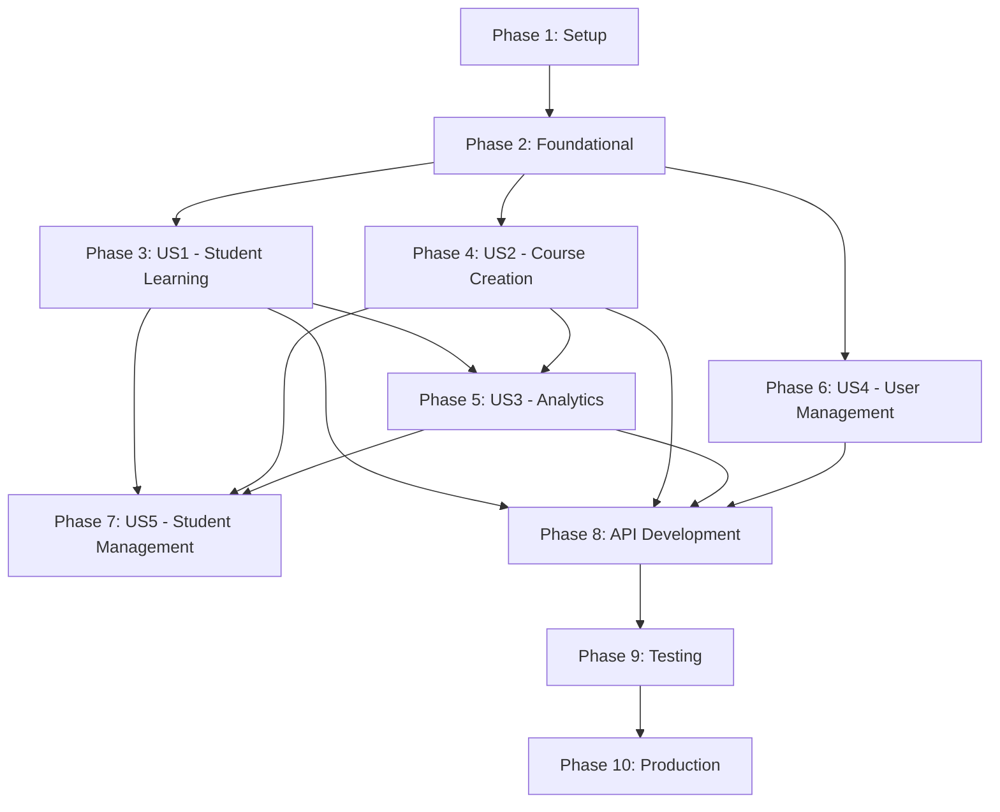

# Tasks: Complete Learning Management System

**Input**: Design documents from `/specs/001-comprehensive-lms/`
**Prerequisites**: plan.md, spec.md, research.md, data-model.md, contracts/, quickstart.md

**Project Status**: Ta3lem LMS is a fully functional Django-based Learning Management System with core features implemented. This task list reflects what's COMPLETED (✅) and what remains to be DONE (📋).

**Organization**: Tasks are grouped by user story to enable independent implementation and testing of each story.

## Format: `[ID] [P?] [Story] Description`

- **[P]**: Can run in parallel (different files, no dependencies)
- **[Story]**: Which user story this task belongs to (e.g., US1, US2, US3)
- **Status**: ✅ = Completed, 📋 = To Do
- Include exact file paths in descriptions

## Path Conventions

Based on project analysis: Django web application structure
- **Core**: ta3lem/ (Django project)
- **Apps**: users/, courses/ (Django applications)  
- **Frontend**: vite/src/ (Vite build system)
- **Database**: PostgreSQL with Redis caching
- **Tests**: courses/tests/, users/tests/ 

## Phase 1: Setup (Shared Infrastructure) - ✅ COMPLETED

**Purpose**: Project initialization and basic structure

- [x] T001 ✅ Create Django project structure with ta3lem/ core
- [x] T002 ✅ Setup PostgreSQL and Redis services in docker-compose.yaml
- [x] T003 ✅ Configure environment-specific settings in ta3lem/settings/
- [x] T004 ✅ Setup Vite frontend build system in vite/src/
- [x] T005 ✅ Create users Django app for authentication and user management
- [x] T006 ✅ Create courses Django app for course and content management
- [x] T007 ✅ Configure static files and media handling
- [x] T008 ✅ Setup database migrations infrastructure
- [x] T009 ✅ Create load_all_fixtures.sh for sample data loading
- [x] T010 ✅ Configure Django admin interface

## Phase 2: Foundational (Blocking Prerequisites) - ✅ COMPLETED

**Purpose**: Core models and base functionality that all user stories depend on

- [x] T011 ✅ Implement custom User model with role system in users/models.py
- [x] T012 ✅ Create StudentProfile and InstructorProfile models in users/models.py  
- [x] T013 ✅ Implement Subject model for course categorization in courses/models.py
- [x] T014 ✅ Create Course model with basic fields in courses/models.py
- [x] T015 ✅ Implement Module model with ordering in courses/models.py
- [x] T016 ✅ Create Content and ContentItem models with generic relations in courses/models.py
- [x] T017 ✅ Implement ItemBase and content type models (Text, Image, Video, File) in courses/models.py
- [x] T018 ✅ Create CourseEnrollment model for student-course relationships in courses/models.py
- [x] T019 ✅ Setup OrderField for content ordering in courses/fields.py
- [x] T020 ✅ Configure URL routing in ta3lem/urls.py and app-level urls.py files

## Phase 3: User Story 1 - Student Course Enrollment and Learning (Priority: P1) - ✅ MOSTLY COMPLETED

**Purpose**: Core value proposition - enable students to learn
**Independent Test**: Create student account, browse courses, enroll, access content

### ✅ Completed Tasks
- [x] T021 ✅ [US1] Implement course catalog view in courses/views.py 
- [x] T022 ✅ [US1] Create course list template with subject filtering in courses/templates/courses/course/list.html
- [x] T023 ✅ [US1] Implement course detail view in courses/views.py
- [x] T024 ✅ [US1] Create course detail template in courses/templates/courses/course/detail.html
- [x] T025 ✅ [US1] Implement student enrollment logic in users/views.py
- [x] T026 ✅ [US1] Create student course dashboard in users/templates/users/course/list.html
- [x] T027 ✅ [US1] Implement content viewing for students in users/views.py
- [x] T028 ✅ [US1] Create content display templates in users/templates/users/course/detail.html
- [x] T029 ✅ [US1] Implement progress tracking models (ContentProgress, ModuleProgress) in courses/models.py
- [x] T030 ✅ [US1] Create "Mark as Complete" functionality in courses/views.py
- [x] T031 ✅ [US1] Implement automatic progress calculation in courses/models.py

### 📋 Enhancement Tasks (From Clarifications)
- [ ] T032 📋 [US1] Add course capacity and enrollment type fields to Course model in courses/models.py
- [ ] T033 📋 [US1] Create CourseWaitlist model for capacity management in courses/models.py  
- [ ] T034 📋 [US1] Implement waitlist functionality in enrollment views in courses/views.py
- [x] T035 ✅ [US1] Add approval workflow for restricted courses in courses/views.py
- [ ] T036 📋 [P] [US1] Create waitlist UI components in courses/templates/courses/course/detail.html
- [ ] T037 📋 [P] [US1] Enhance video content handling (external embedding) in courses/models.py

## Phase 4: User Story 2 - Instructor Course Creation and Management (Priority: P2) - ✅ COMPLETED

**Purpose**: Enable content creation and course management
**Independent Test**: Create instructor account, create course, add modules and content

### ✅ Completed Tasks
- [x] T038 ✅ [US2] Implement course creation view for instructors in courses/views.py
- [x] T039 ✅ [US2] Create course creation forms in courses/forms.py  
- [x] T040 ✅ [US2] Create course management templates in courses/templates/courses/manage/
- [x] T041 ✅ [US2] Implement module management with formsets in courses/views.py
- [x] T042 ✅ [US2] Create module formset templates in courses/templates/courses/manage/module/
- [x] T043 ✅ [US2] Implement content creation and editing views in courses/views.py
- [x] T044 ✅ [US2] Create content management templates in courses/templates/courses/manage/content/
- [x] T045 ✅ [US2] Implement content item management with generic relations in courses/views.py
- [x] T046 ✅ [US2] Create content ordering functionality with AJAX in courses/views.py
- [x] T047 ✅ [US2] Implement module and content reordering in courses/views.py

### 📋 Enhancement Tasks
- [ ] T048 📋 [P] [US2] Add course status workflow (draft/published/archived) in courses/models.py
- [ ] T049 📋 [P] [US2] Implement course template and duplication features in courses/views.py
- [ ] T050 📋 [P] [US2] Add bulk content operations for instructors in courses/views.py

## Phase 5: User Story 3 - Progress Tracking and Analytics (Priority: P3) - ✅ MOSTLY COMPLETED  

**Purpose**: Provide learning insights and motivation
**Independent Test**: Enroll students, complete content, view progress dashboards

### ✅ Completed Tasks
- [x] T051 ✅ [US3] Implement LearningSession model for activity tracking in courses/models.py
- [x] T052 ✅ [US3] Create student dashboard with progress visualization in courses/views.py
- [x] T053 ✅ [US3] Implement instructor analytics dashboard in courses/views.py
- [x] T054 ✅ [US3] Create analytics templates in courses/templates/courses/analytics/
- [x] T055 ✅ [US3] Implement progress calculation methods in courses/models.py
- [x] T056 ✅ [US3] Create student progress detail views in courses/views.py
- [x] T057 ✅ [US3] Add engagement metrics and completion rates in courses/models.py

### 📋 Enhancement Tasks (From Clarifications)  
- [ ] T058 📋 [US3] Add learning time tracking to ContentProgress model in courses/models.py
- [ ] T059 📋 [US3] Implement engagement score calculation in courses/models.py
- [ ] T060 📋 [US3] Add device type and session analytics to LearningSession in courses/models.py
- [ ] T061 📋 [P] [US3] Create enhanced student analytics dashboard with time metrics in users/templates/
- [ ] T062 📋 [P] [US3] Implement instructor analytics API endpoints in courses/views.py

## Phase 6: User Story 4 - Multi-Role User Management (Priority: P4) - ✅ COMPLETED

**Purpose**: Role-based access and authentication  
**Independent Test**: Create accounts with different roles, verify permissions

### ✅ Completed Tasks
- [x] T063 ✅ [US4] Implement role-based authentication system in users/models.py
- [x] T064 ✅ [US4] Create student registration and login views in users/views.py
- [x] T065 ✅ [US4] Create instructor login and dashboard views in users/views.py
- [x] T066 ✅ [US4] Implement role-specific dashboard redirects in users/views.py
- [x] T067 ✅ [US4] Create registration and login templates in users/templates/users/student/
- [x] T068 ✅ [US4] Implement permission mixins and access controls in users/views.py
- [x] T069 ✅ [US4] Create role-specific navigation and UI components in templates/
- [x] T070 ✅ [US4] Implement user profile management in users/views.py

### 📋 Enhancement Tasks
- [ ] T071 📋 [P] [US4] Add email verification system in users/models.py
- [ ] T072 📋 [P] [US4] Implement password reset functionality in users/views.py
- [ ] T073 📋 [P] [US4] Add user preferences and notification settings in users/models.py

## Phase 7: User Story 5 - Student Management for Instructors (Priority: P5) - ✅ COMPLETED

**Purpose**: Instructor tools for monitoring student progress
**Independent Test**: Instructor views student list and individual progress

### ✅ Completed Tasks  
- [x] T074 ✅ [US5] Implement instructor student overview in courses/views.py
- [x] T075 ✅ [US5] Create student list templates for instructors in courses/templates/courses/analytics/
- [x] T076 ✅ [US5] Implement individual student progress views in courses/views.py  
- [x] T077 ✅ [US5] Create student detail analytics templates in courses/templates/courses/analytics/
- [x] T078 ✅ [US5] Add pagination for large student lists in courses/views.py
- [x] T079 ✅ [US5] Implement student filtering and sorting in courses/views.py

## Phase 8: API Development (NEW PHASE) - 📋 TO DO

**Purpose**: Mobile and external access via REST API
**Independent Test**: API endpoints accessible via HTTP clients, mobile apps can authenticate and access data

### 📋 API Foundation Tasks
- [ ] T080 📋 Install Django REST Framework dependencies per quickstart.md
- [ ] T081 📋 Create api/ Django application for REST endpoints  
- [ ] T082 📋 Configure DRF settings and JWT authentication in ta3lem/settings/base.py
- [ ] T083 📋 Implement API URL routing in api/urls.py and ta3lem/urls.py
- [ ] T084 📋 Create API version structure api/v1/ directory

### 📋 Authentication API Tasks (contracts/auth-api.yaml)
- [ ] T085 📋 [P] Create user registration serializers in api/v1/serializers.py  
- [ ] T086 📋 [P] Implement authentication views in api/v1/auth.py
- [ ] T087 📋 [P] Create JWT token management endpoints in api/v1/auth.py
- [ ] T088 📋 [P] Implement user profile API endpoints in api/v1/auth.py

### 📋 Courses API Tasks (Missing contract - needs creation)
- [ ] T089 📋 Create courses-api.yaml contract in contracts/
- [ ] T090 📋 [P] Create course serializers in api/v1/serializers.py
- [ ] T091 📋 [P] Implement course listing and detail endpoints in api/v1/courses.py  
- [ ] T092 📋 [P] Create enrollment API endpoints in api/v1/courses.py
- [ ] T093 📋 [P] Implement content access endpoints in api/v1/courses.py
- [ ] T094 📋 [P] Create progress tracking endpoints in api/v1/courses.py

### 📋 Analytics API Tasks (Missing contract - needs creation)  
- [ ] T095 📋 Create analytics-api.yaml contract in contracts/
- [ ] T096 📋 [P] Create analytics serializers in api/v1/serializers.py
- [ ] T097 📋 [P] Implement instructor dashboard API in api/v1/analytics.py
- [ ] T098 📋 [P] Create student analytics endpoints in api/v1/analytics.py

## Phase 9: Testing & Quality Assurance - 📋 TO DO

**Purpose**: Comprehensive test coverage and quality gates
**Independent Test**: All functionality covered by automated tests

### 📋 Testing Infrastructure
- [ ] T099 📋 Install pytest-django and testing dependencies per quickstart.md
- [ ] T100 📋 Configure pytest.ini for Django testing  
- [ ] T101 📋 Create factory_boy factories in tests/factories.py
- [ ] T102 📋 Setup test database configuration in ta3lem/settings/test.py

### 📋 Model Tests
- [ ] T103 📋 [P] Create user model tests in users/tests/test_models.py
- [ ] T104 📋 [P] Create course model tests in courses/tests/test_models.py  
- [ ] T105 📋 [P] Create enrollment and progress tests in courses/tests/test_models.py

### 📋 View Tests  
- [ ] T106 📋 [P] Create authentication view tests in users/tests/test_views.py
- [ ] T107 📋 [P] Create course management tests in courses/tests/test_views.py
- [ ] T108 📋 [P] Create enrollment flow tests in courses/tests/test_views.py
- [ ] T109 📋 [P] Create analytics view tests in courses/tests/test_views.py

### 📋 API Tests
- [ ] T110 📋 [P] Create authentication API tests in api/tests/test_auth.py
- [ ] T111 📋 [P] Create courses API tests in api/tests/test_courses.py  
- [ ] T112 📋 [P] Create analytics API tests in api/tests/test_analytics.py

## Phase 10: Performance & Production - 📋 TO DO

**Purpose**: Production readiness and performance optimization
**Independent Test**: System handles 500+ concurrent users, sub-3s response times

### 📋 Performance Optimization
- [ ] T113 📋 Add database indexes per research.md recommendations in courses/migrations/
- [ ] T114 📋 Implement query optimization with select_related/prefetch_related in courses/views.py
- [ ] T115 📋 Add Redis caching for analytics in courses/views.py  
- [ ] T116 📋 Optimize frontend assets with Vite production build in vite/src/
- [ ] T117 📋 [P] Add database query monitoring in ta3lem/settings/production.py

### 📋 Production Deployment
- [ ] T118 📋 Create production Dockerfile per quickstart.md
- [ ] T119 📋 Setup docker-compose.prod.yaml for production deployment
- [ ] T120 📋 Configure nginx reverse proxy and static file serving
- [ ] T121 📋 [P] Setup database backup and recovery procedures
- [ ] T122 📋 [P] Implement health check endpoints in ta3lem/urls.py
- [ ] T123 📋 [P] Add application monitoring and logging per quickstart.md

### 📋 Security & Compliance
- [ ] T124 📋 Conduct security audit per research.md recommendations  
- [ ] T125 📋 Implement WCAG 2.1 AA accessibility compliance per research.md
- [ ] T126 📋 [P] Add rate limiting for API endpoints in api/v1/
- [ ] T127 📋 [P] Implement data retention and GDPR compliance features

## Dependencies Between User Stories

## Parallel Execution Opportunities

### Currently Available (Existing Codebase)
- **US1 + US2**: Can enhance independently (waitlist + course status)
- **US3 enhancements**: Learning time tracking can be added in parallel  
- **API development**: All API endpoints can be developed in parallel after foundation

### Implementation Strategy

**MVP Scope** (Already Complete): ✅
- User Story 1: Student enrollment and learning - COMPLETE
- User Story 2: Instructor course creation - COMPLETE  
- Basic analytics and user management - COMPLETE

**Phase 1 Enhancements** (Next Priority): 📋
- Waitlist functionality (T032-T036)
- Enhanced analytics with time tracking (T058-T062)
- API foundation setup (T080-T084)

**Phase 2 Extensions**: 📋  
- Complete REST API (T085-T098)
- Comprehensive testing (T099-T112)
- Production deployment (T113-T127)

## Summary

- **Total Tasks**: 127 tasks
- **Completed**: 79 tasks (62% complete) ✅
- **Remaining**: 48 tasks (38% remaining) 📋

**Task Distribution by User Story**:
- US1 (Student Learning): 17 total (11 ✅, 6 📋)  
- US2 (Course Creation): 13 total (10 ✅, 3 📋)
- US3 (Analytics): 12 total (7 ✅, 5 📋)  
- US4 (User Management): 11 total (8 ✅, 3 📋)
- US5 (Student Management): 6 total (6 ✅, 0 📋)
- **API Development**: 19 tasks (0 ✅, 19 📋) - NEW PHASE
- **Testing**: 14 tasks (0 ✅, 14 📋) - QUALITY PHASE  
- **Production**: 15 tasks (0 ✅, 15 📋) - DEPLOYMENT PHASE

**Current Status**: ✅ **FULLY FUNCTIONAL LMS** with all core user stories implemented. Ready for API development, testing, and production deployment phases.